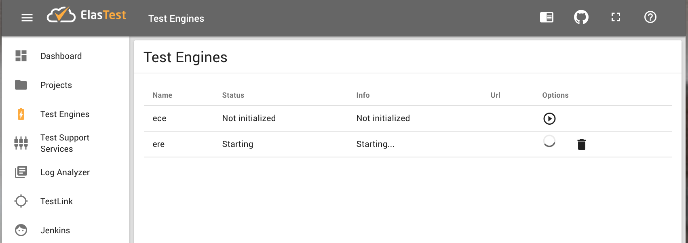
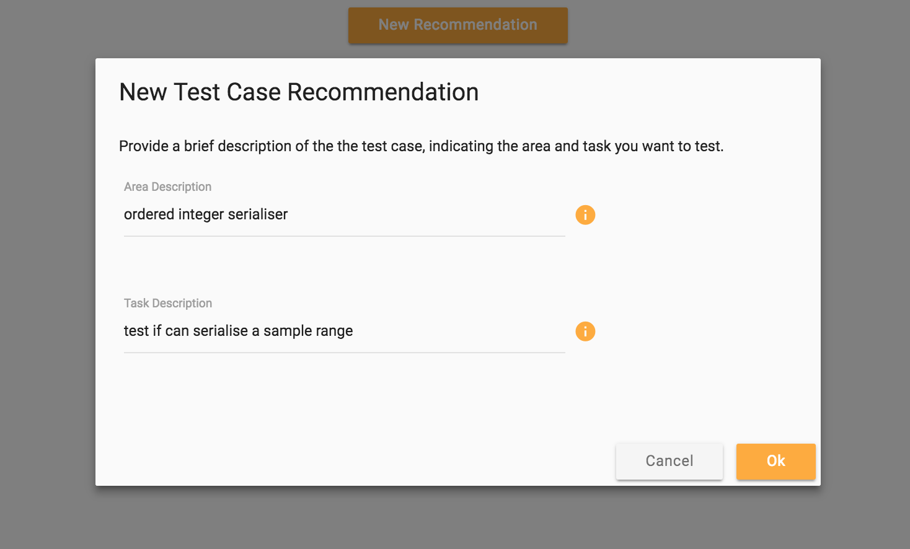
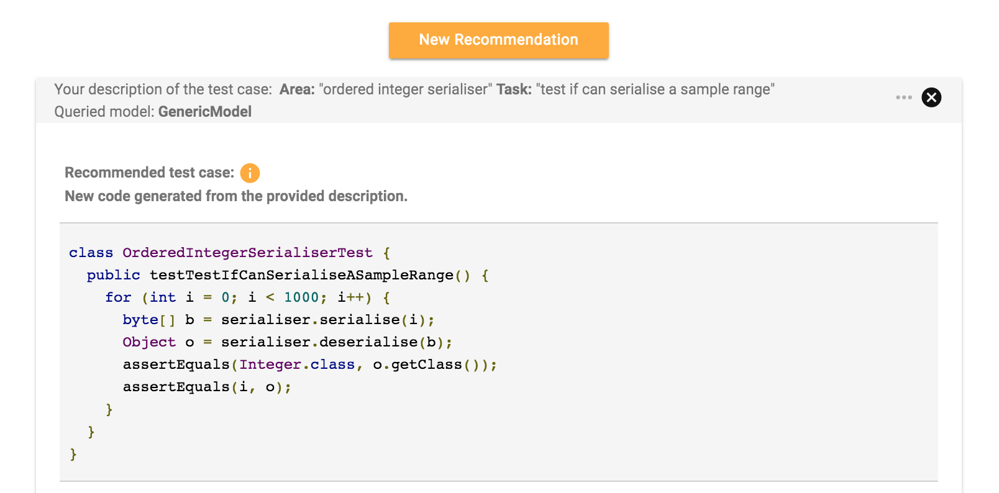
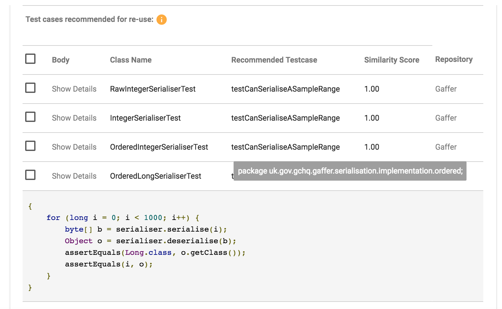
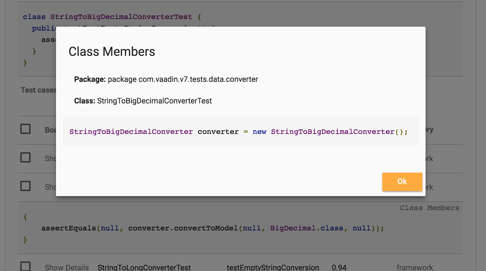

ElasTest Recommendation Engine
=================
ElasTest Recommendation Engine (ERE) supports test automation developers by providing two types of recommendations. First, it recommends complete Java implementations of unit test cases based on short descriptions in natural language provided by a tester. Second, it recommends a list of test cases that are most relevant to the test case generated based on user's description.

ERE follows the Neural Machine Translation (NMT) model architecture described in [[1]](#luong), which was designed for the task of performing translation between natural languages. ERE applies the NMT model to the code generation task. It ingests large amounts of data stored in software repositories to learn deep vector representations of source code modules. It then uses these representations to map natural language descriptions to source code (for the first type of recommendations) and to compute the degree of similarity between test cases (for the second type of recommendations).

The trial version includes off-the-shelf model trained on over 700 online source code repositories available on GitHub. To ensure high quality of the code, only most popular repositories (1,000 stars and more) were considered as the source of training data. This Generic Model is capable of generating approximate recommendations, and will be most appropriate for teams that do not have their own training data, i.e. working on new projects with a minimal codebase.

For users who wish to receive very accurate recommendations (requiring little or no editing), and have a medium or large database of automated code relevant to their domain, the best solution is training a custom model. The model trained on users own data will be much more precise without the need for increasing the size. As the part of the trial offering, we will train a project-specific model for users who will directly contact [Innovation Exchange](mailto:iix.elastest@ie.ibm.com).

## Features
Feature | Description
---------| -----------
Recommending new test code | Based on short natural language description of a test case, user receives recommended Java implementation of that test case (newly generated code).
Recommending automated test cases for reuse/adaptation | Based on short natural language description of a test case, user receives a list of existing automated test cases that are most relevant to the query.

## How to run
ElasTest Recommendation Engine runs in the context of [ElasTest platform](https://elastest.io/docs/) and can be launched from ElasTest Dashboard.

#### Procedure
1. Start ElasTest platform:

`docker run --rm -v ~/.elastest:/data -v /var/run/docker.sock:/var/run/docker.sock --rm elastest/platform start -m=singlenode`

2. Use browser to access ElasTest Dashboard.
3. Navigate to Test Engines page and start 'ere'.

**Note:**
The first time you start ERE, you need to wait a couple of minutes for the image to get pulled from ElasTest repository. Once the image is present on your system, starting and stopping ERE is quick. The current size of /elastest/ere-trial image is 4.2 GB (it will be decreased in future releases).

4. Click on eye icon to access ERE UI.

###  New Recommendation wizard
Click on 'New Recommendation' button in the main page to enter a description of a test case. In the 'Area Description' field, provide a more general description of the tested area, such as a description of functionality of the class under test. In the 'Task Description' field, indicate the specific task or functionality to be tested. Click OK to submit your query.

### Results Page
For each query, ERE produces two types of recommendations: (1) new code generated from the area and task description, and (2) a list of existing test cases retrieved from the software repository based on their similarity to the generated test case.

#### Generated code
The new code inferred by the machine learning model is checked for syntax. If it complies to basic Java syntax rules, it is displayed on the top of the page (embedded into a mock class), otherwise it is skipped.

#### Test cases for reuse
The list of existing test cases recommended for re-use is displayed in a table. The table provides information that helps to locate the reusable test cases in the repository. Each row includes the name of the class containing the recommended test method and the name of that method, as well as the score indicating the degree of similarity to the generated code.

Click on 'Show Details' link to display the body of the method.

Hover over a class name to view package name.

Click on the 'Class Members link (if available) to view the members of the class containing the recommended test case.

Click on the 'Repository' link to open the repository of origin and inspect the context of the recommended test case.

 [1] Luong, T.; Pham, H.; Manning, C.D. Effective Approaches to Attention-based Neural Machine Translation.
In Proceedings of the 2015 Conference on Empirical Methods in Natural Language Processing, Lisbon, Portugal,
17–21 September 2015; pp. 1412–1421.
